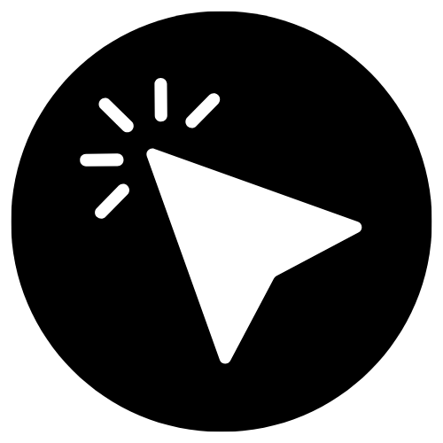

  
  <h1>Clickity</h1>
  
<strong>Simple, Elegant Counter with Haptics</strong>

  

    
    
    
    
    
  

---

**Clickity** is a simple, elegant counter app designed with focus and usability in mind.

It goes beyond basic counting by adding tactile haptic feedback and immersive themes, making it perfect for habit tracking, inventory, or just fidgeting.

## 🚀 Why Clickity?

| Feature | Clickity | Generic Counter Apps |
| :--- | :--- | :--- |
| **Feedback** | 📳 **Haptic** (Vibrations) | 🔇 **None** (Visual only) |
| **Aesthetics** | 🎨 **Elegant** (AMOLED Themes) | 🗑️ **Cluttered** (Ads/Basic) |
| **Privacy** | 🔒 **Local** (No Tracking) | 🕵️ **Variable** (Often Analytics) |
| **Install** | 📱 **PWA** (No Store Req.) | 📥 **Store Download** |

## ✨ Key Features

*   **Minimalist Design**: ✨ Clean interface focused purely on usability.
*   **Themes**: 🎨 Switch between Light, Dark, and **Jet Black (AMOLED)** modes.
*   **Haptic Feedback**: 📳 Satisfying vibrations on every tap (supported devices).
*   **Sound Effects**: 🔊 Subtle audio cues for interactions.
*   **PWA Ready**: 📱 Installable on your device for a native-like experience.
*   **Local Storage**: 💾 Your count is saved automatically.

## 📦 Dependencies
This project is a static web application using:
*   **HTML5**
*   **Tailwind CSS**
*   **Vanilla JavaScript**

## 📄 License
MIT License. Open source and available for everyone.

---

  Made with ❤️ by <a href="mailto:arunthomas04042001@gmail.com">Arun Thomas</a>

